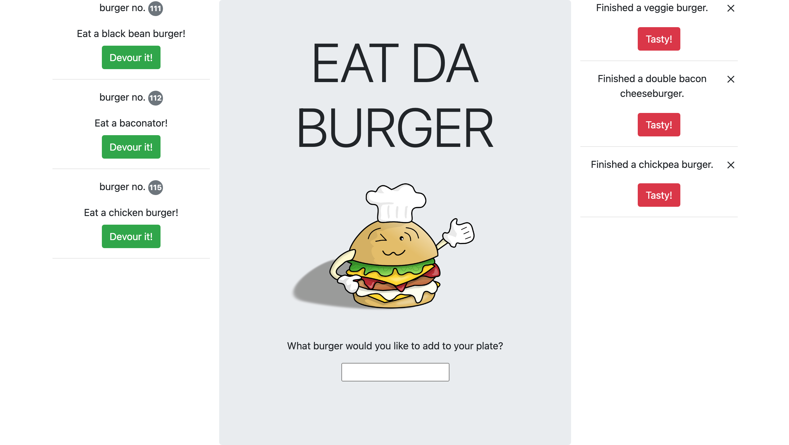

# Eat Da Burger
A burger logger with MySQL, Node, Express, Handlebars and homemade ORM.

## Table of Contents
1. [ Description ](#desc)
2. [ Visuals ](#visuals)
3. [ Deployed Webpage ](#deployed)
4. [ Support ](#support)
5. [ Authors and Acknowledgement ](#acknowledge)
6. [ Next Steps ](#next)
7. [ License ](#license)

## 1. Description
A deployed HTML website that lets you add, eat, and delete burgers! It also saves your current burgers and loads them for the next time.

### Summary of functionality
- The user can add a burger to eat, eat a burger, delete an eaten burger, and still have the burgers there for them next time they start the app.
- The user interact indirectly with the database when they add/delete/etc burgers.
- I used an online database to store the data
- This app uses mySQL (database), handlebars (styling and rendering), and express (routing).

## 2. Visuals
Screenshot of the CLI:

## 3. Deployed Website
[Here it is!](https://tasha876-burger.herokuapp.com/)

## 4. Support
Should you find an issue with this webpage, please create a [new issue](https://github.com/Tasha876/burger/issues/new/choose) on my GitHub repository.

## 5. Authors and Acknowledgement
The code in this project was created by Natasha Fray. The idea is from the instructors at the [U of T Coding Bootcamp](https://bootcamp.learn.utoronto.ca/)

## 6. Next Steps
This is a very simple virtual burger eating app and could benefit from the following updates
- Improved UI.
- A landing page to explain what the user will do on the site.
- Add pictures and animations when adding/eating a burger (I'm hosting on Heroku though).
- The ability to log in so only you can see your current burgers.

## 7. License
This project is covered by the [MIT](license) license.